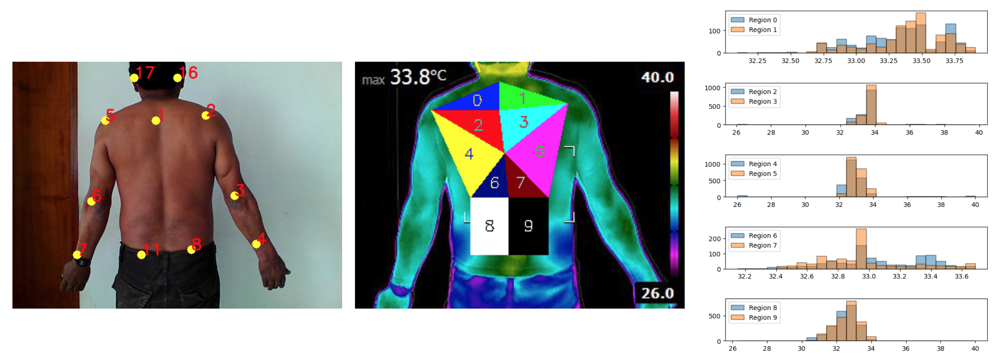
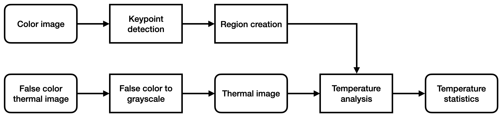
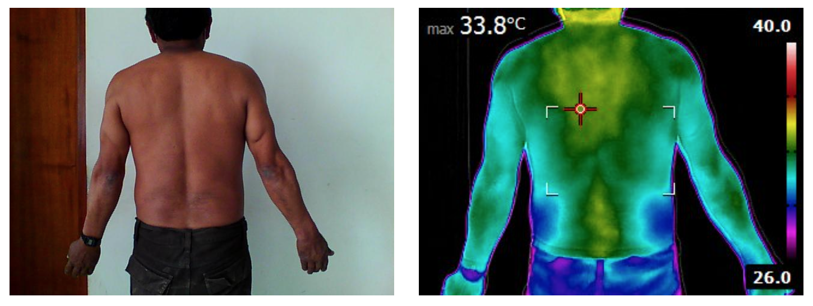
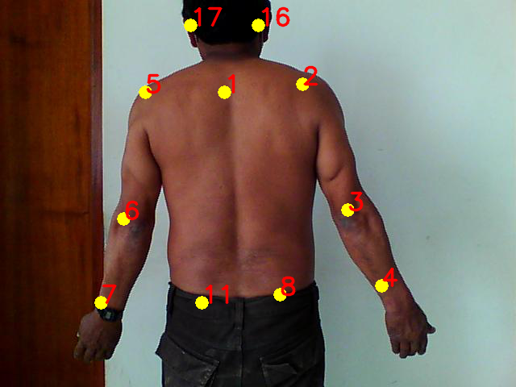

# Temperature Analysis on Different Parts of the Back of Patients Using Thermal Imaging and Pose Estimation

**Temperature analysis:** From left to right--keypoint detection on RGB image using OpenPose algorithm; thermal image with regions to analyze; temperature histograms
 

 

This repository contains the code for a temperature analysis agorithm using thermal images of the back of patients. This project was developed in collaboration with the Work & Health occupation clinic. The algorithm finds keypoints of several body parts of the patient, such as the neck, shoulders and lower back. Then, 10 regions are generated from combinations of the keypoints, covering most of the back, and statistical parameters are computed from each of the regions. A health professional could potentially use this tool to detect back lesions in patients by comparing the temperature statistics of regions that are located opposite to each other.

## Algorithm description

### Pose estimation

A Flir handheld camera was used to acquire both color and thermal images of patients. The color image has a resolution of 480x640 pixels, while the thermal image has a resolution of 240x320 pixels. 

The first stage consists of using the color image to find the patient keypoints using the OpenPose algorithm. This algorithm is trained with two datasets: COCO and MPII, which are able to find different keypoints. When the two models share a keypoint (for example, the neck of the patient), the coordinates found by both models are averaged in order to increase the prediction accuracy. After finding all keypoints, 10 regions are generated from the combinations of them, covering most of the patient's back. The equations used to find generate the regions are written on ``utils.py``. It is worth mentioning that each region has a corresponding pair, which is the horizontally mirrored region. Pairs of back regions are used to perform the temperature analysis.

### Temperature statistics

After finding the 10 back regions, temperature analysis is performed by computing seven statistical parameters of each region's temperature: the (1) mean, (2) standard deviation, (3) minimum value, (4) maximum value, (5) 25th percentile, (6) median and (7) 75th percentile. If there is a noticeable difference in the statistics of a pair of regions (for example, between the maximum value of the left vs. right shoulder), then a doctor could potentially request a more rigorous evaluation of the patient.

